# LOTES DE PRUEBA
| Descripción                        | Salida esperada           | Salida obtenida    
| ---------------------------------- | ------------------------- | --------------------
| Jugada en modo Facil: Se quiere probar que el jugador gane de la manera mas rapida posible. | Se espera que el jugador humano siempre gane este modo de dificultad. | Resultado exitoso! El oponente siempre puede ganar, depende del azar de la maquina igualmente. 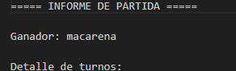|
| Carta Espejo: Se quiere probar el funcionamiento de la carta ante cartas positivas y negativas. | Se espera que al tirar la carta espejo anule el efecto y lo devuelva al oponente. | Resultado exitos! devuelve el efecto correctamente 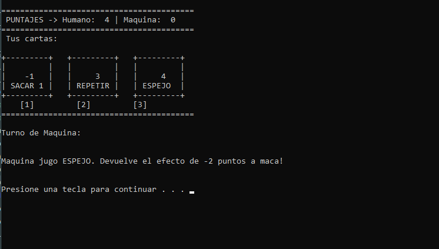|
| Carta Repetir Turno: Se quiere probar la cantidad de veces que puede ser utilizada esta carta. | Se espera que la carta repetir turno funcione correctamente al menos 2 veces seguidas. | Resultado exitoso! Se puede usar las veces que los oponentes tiren sus cartas. 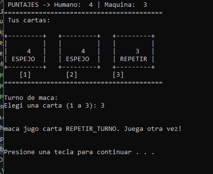|
| Espejo inefectuada: Se quiere probar que efecto tiene la carta espejo al tirarla cualquier carta no negativa| Se espera que si el oponente tira una carta que no sea ni menos -1 o -2 y el siguiente tira una carta ESPEJO, esta no tenga efecto.  | Resultado exitoso, el programa muestra exitosamente como queda inefectuada 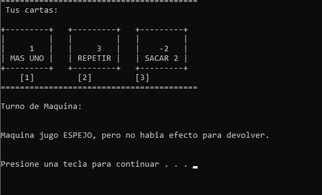|
| Repeticion de Turno de Maquina: Se quiere probar la jugada que puede realizar la maquina con la carta repetir turno en modo Dificil. | Se espera que la maquina solo tire la carta repetir turno si tiene dos cartas buenas en su mano. | Resultado exitoso la maquina tira correctamente el REPETIR TURNO y luego tira una carta positiva 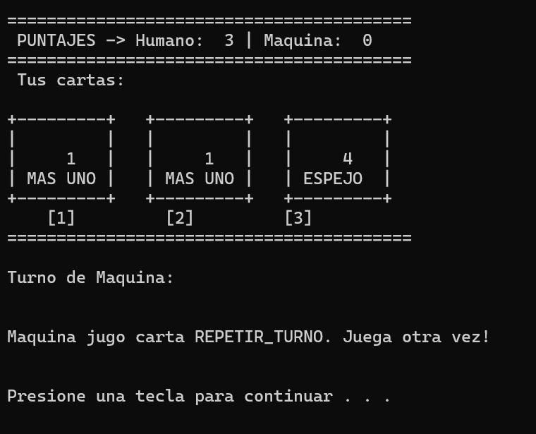|
| Cartas Inefectuadas: Funcionamiento de las cartas -1 y -2 cuando el jugador o la maquina esta a 0 puntos. | Se espera que al tirar las cartas -1 y -2 con el oponente a 0 puntos no modifique ningun puntaje y siga el juego. | Resultado exitoso! si bien la imagen dice que le saca un ppunto, esto es mensaje del efecto a realizar pero si bien no lo hace ya que esta a 0 puntos. Sino quedaria en -1. 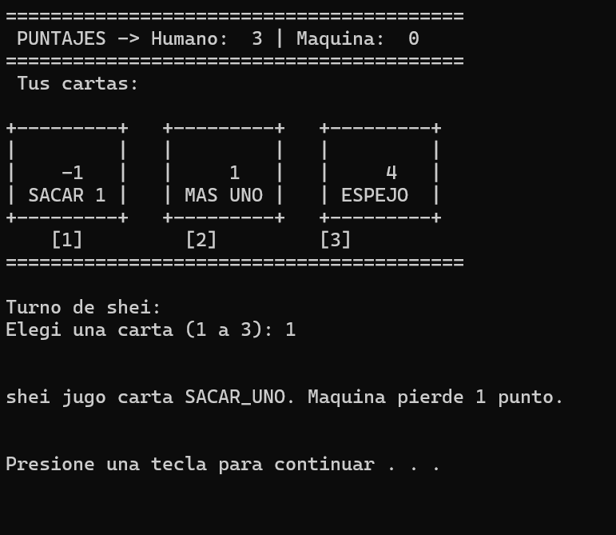|
| Resultado Api: Se desea ver el ranking aunque hayan partidas ya realizadas pero ninguno le haya ganado a la IA. | Se espera que al ver el ranking de DoCe y ningun jugador haya ganado todavia, aparezca su nombre con 0 partidas ganadas. | Resultado exitoso, muestra correctamente todos los jugadores de DoCe incluso no hayan ganado. 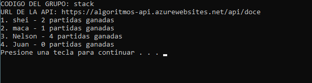|
| Carta Espejo Consecutiva: Se desea probar que pasa si al tirar una carta negativa esta se devuelve con espejo y posterior a eso se tira otro del mismo tipo (espejo). | Se espera que al tirar la primera carta devuelva el efecto correctamente pero la consecutiva devuelve el primer efecto negativo. | Resultado exitoso, el primer jugador tira el efecto negativo, el primer espejo te saca los puntos pero el segundo se los saca al oponente y te los devuelve a al ultimo juador en tirar la carta Espejo. 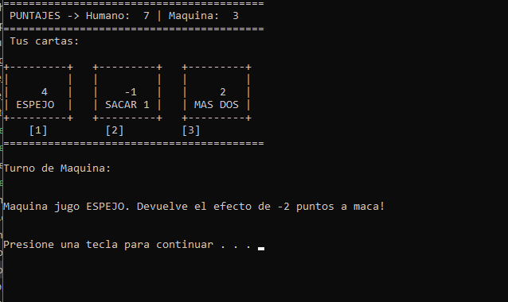 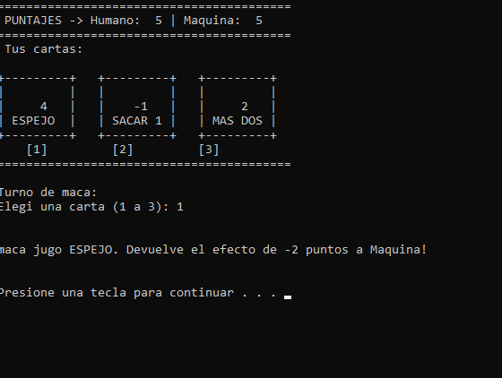|
| Fin del mazo: Se desea probar el correcto funcionamiento del mazo descarte, mezclado de las cartas y se pueda re insertar en el juego exitosamente. | Se espera que al terminarse el mazo de juego, se reponga nuevamente para seguir la partida. | El resultao obtenido fue exitoso, si bien no tenemos una forma visual de verlo, el juego nunca para el juego hasta que alguno de los 2 llegue a 12.|
| Modo dificil: Se desea probar las condiciones de la IA dificil usando las mejores cartas para ganar lo mas rapido posible. | Se espera que al jugador humano se le dificulte ganarle a la maquina de al menos 100 rondas o incluso pierda en modo dificil.  | Resultado exitoso! La maquina devuelve bien los efectos negativos y prioriza sumarse puntos si el humano casi no tiene chances de ganar. 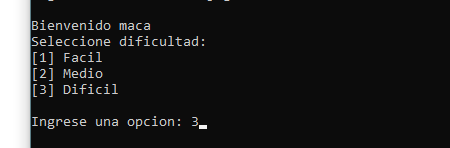 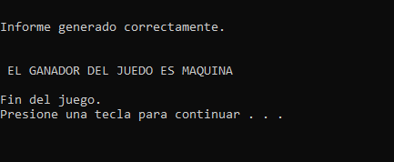 |
| Codigos Invalido: Se desea probar que al seleccionar una tecla fuera de los valores pedidos por el programa no lo ingrese como valido.   | Se espera que al ingresar el codigo fuera de rango, no lo tome como valido y pida uno nuevo. | Resultado exitoso! Pide un valor nuevo al ingresar un codigo erroneo. 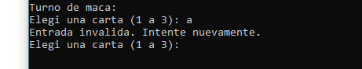|

